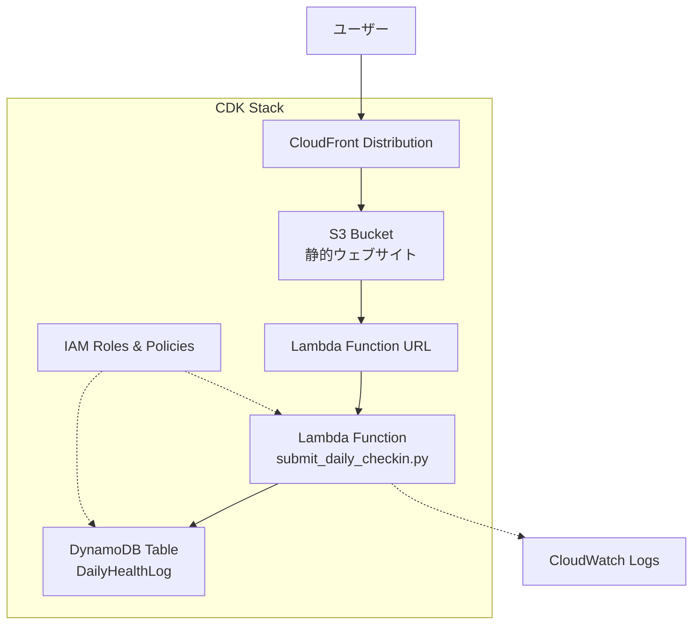

# 設計書

## 概要

この設計書は、既存のサーバーレスデイリーチェックインアプリケーションをAWS CDKでIaC化するための詳細な設計を定義します。現在手動でデプロイされているインフラストラクチャ（S3静的サイト、Lambda関数、DynamoDB）をCDKコードで管理可能にし、再現可能で保守性の高いデプロイメントを実現します。

## アーキテクチャ

### システム構成図



### アーキテクチャの特徴

1. **サーバーレス構成**: 管理するサーバーなし、自動スケーリング
2. **CDN配信**: CloudFrontによる高速グローバル配信
3. **直接統合**: Lambda Function URLによるシンプルなAPI
4. **NoSQL永続化**: DynamoDBによる高可用性データストレージ
5. **IaC管理**: CDKによるインフラストラクチャのコード化

## コンポーネントと インターフェース

### 1. CDKスタック構成

```python
class DailyCheckinStack(Stack):
    """
    デイリーチェックインアプリケーション用のCDKスタック
    既存の手動デプロイされたインフラをIaC化
    """
    
    def __init__(self, scope: Construct, construct_id: str, **kwargs):
        # S3バケット（静的ウェブサイト）
        # CloudFrontディストリビューション
        # Lambda関数（既存コード使用）
        # Lambda Function URL
        # DynamoDBテーブル
        # IAMロールとポリシー
```

### 2. S3静的ウェブサイトコンポーネント

**目的**: 既存のS3/index.htmlをCDKで管理

**設計仕様**:
- バケット名: `daily-checkin-static-{環境}`
- ウェブサイトホスティング有効
- パブリック読み取りアクセス（CloudFront経由のみ）
- バージョニング有効（ロールバック対応）

```python
# S3バケット設定
bucket = s3.Bucket(
    self, "StaticWebsiteBucket",
    bucket_name=f"daily-checkin-static-{environment}",
    website_index_document="index.html",
    versioned=True,
    public_read_access=False,  # CloudFront経由のみ
    block_public_access=s3.BlockPublicAccess.BLOCK_ACLS
)
```

### 3. CloudFrontディストリビューションコンポーネント

**目的**: 既存のCloudFront設定をCDKで再現

**設計仕様**:
- オリジン: S3バケット
- デフォルトルートオブジェクト: index.html
- HTTPS強制リダイレクト
- キャッシュ設定: 静的アセット用最適化
- OAI（Origin Access Identity）使用

```python
# CloudFrontディストリビューション
distribution = cloudfront.Distribution(
    self, "WebsiteDistribution",
    default_behavior=cloudfront.BehaviorOptions(
        origin=origins.S3Origin(bucket, origin_access_identity=oai),
        viewer_protocol_policy=cloudfront.ViewerProtocolPolicy.REDIRECT_TO_HTTPS,
        cache_policy=cloudfront.CachePolicy.CACHING_OPTIMIZED
    ),
    default_root_object="index.html"
)
```

### 4. Lambda関数コンポーネント

**目的**: 既存のlamda/submit_daily_checkin.pyをCDKでデプロイ

**設計仕様**:
- ランタイム: Python 3.9
- ソースコード: 既存ファイル使用
- タイムアウト: 30秒
- メモリ: 128MB（最小構成）
- 環境変数: DynamoDBテーブル名

```python
# Lambda関数
lambda_function = _lambda.Function(
    self, "SubmitCheckinFunction",
    runtime=_lambda.Runtime.PYTHON_3_9,
    code=_lambda.Code.from_asset("lamda"),  # 既存ディレクトリ
    handler="submit_daily_checkin.lambda_handler",
    timeout=Duration.seconds(30),
    memory_size=128,
    environment={
        "DYNAMODB_TABLE_NAME": dynamodb_table.table_name
    }
)
```

### 5. Lambda Function URLコンポーネント

**目的**: API Gateway不要のシンプルなHTTPエンドポイント

**設計仕様**:
- 認証: NONE（パブリックアクセス）
- CORS: CloudFrontドメイン許可
- HTTPメソッド: POST
- レスポンス形式: HTML（既存コードと互換）

```python
# Function URL設定
function_url = lambda_function.add_function_url(
    auth_type=_lambda.FunctionUrlAuthType.NONE,
    cors=_lambda.FunctionUrlCorsOptions(
        allowed_origins=["*"],  # 本番では特定ドメインに制限
        allowed_methods=[_lambda.HttpMethod.POST],
        allowed_headers=["Content-Type"]
    )
)
```

### 6. DynamoDBテーブルコンポーネント

**目的**: 既存のDailyHealthLogテーブルをCDKで管理

**設計仕様**:
- テーブル名: DailyHealthLog
- パーティションキー: Date (String)
- ソートキー: Period (String)
- 課金モード: オンデマンド
- ポイントインタイムリカバリ: 有効

```python
# DynamoDBテーブル
dynamodb_table = dynamodb.Table(
    self, "DailyHealthLogTable",
    table_name="DailyHealthLog",
    partition_key=dynamodb.Attribute(
        name="Date",
        type=dynamodb.AttributeType.STRING
    ),
    sort_key=dynamodb.Attribute(
        name="Period", 
        type=dynamodb.AttributeType.STRING
    ),
    billing_mode=dynamodb.BillingMode.ON_DEMAND,
    point_in_time_recovery=True
)
```

## データモデル

### DynamoDBテーブルスキーマ

**テーブル名**: DailyHealthLog

**キー構造**:
- **パーティションキー**: Date (String) - YYYY-MM-DD形式
- **ソートキー**: Period (String) - "morning" または "evening"

**属性**:
```python
{
    "Date": "2024-01-24",           # PK: 日付
    "Period": "morning",            # SK: 時間帯
    "Condition": "普通",            # 体調
    "IsRoutine": "できた",          # ルーティーン
    "WorkPlace": "通所",            # 学習場所
    "WorkDetail": "IT学習",         # 学習内容
    "Notes": "特になし",            # 備考
    "SleepingHours": "7.0",         # 睡眠時間
    "EnergyMorning": "6",           # 気力（朝）
    "EnergyEvening": "5",           # 気力（夕方）
    "StaminaMorning": "6",          # 体力（朝）
    "StaminaEvening": "5",          # 体力（夕方）
    "Timestamp": "2024-01-24T09:30:00+09:00"  # 登録日時
}
```

### フロントエンドデータフロー

1. **ユーザー入力** → HTMLフォーム（S3/index.html）
2. **フォーム送信** → HTMX POST → Lambda Function URL
3. **データ処理** → Lambda関数 → DynamoDB書き込み
4. **レスポンス** → HTML断片 → HTMX DOM更新

## 正確性プロパティ

*プロパティとは、システムのすべての有効な実行において真であるべき特性や動作のことです。プロパティは、人間が読める仕様と機械で検証可能な正確性保証の橋渡しとなります。*

### プロパティ分析の前作業

受入基準テスト前作業を実施します：

### CDKインフラストラクチャ正確性プロパティ

#### プロパティ1: S3バケット設定の正確性
*すべての*CDKデプロイメントにおいて、作成されるS3バケットはウェブサイトホスティングが有効で、バージョニングが有効で、適切な読み取り権限を持つべきである
**検証対象: 要件 1.1, 1.2, 1.3, 1.4**

#### プロパティ2: CloudFrontディストリビューション設定の正確性
*すべての*CDKデプロイメントにおいて、作成されるCloudFrontディストリビューションはS3バケットをオリジンとし、HTTPS強制、適切なキャッシュ設定、index.htmlをデフォルトルートオブジェクトとして持つべきである
**検証対象: 要件 2.1, 2.2, 2.3, 2.4**

#### プロパティ3: Lambda関数設定の正確性
*すべての*CDKデプロイメントにおいて、作成されるLambda関数は指定されたソースコード、Python 3.9以降のランタイム、適切なIAM権限、DynamoDBテーブル名の環境変数、30秒以上のタイムアウトを持つべきである
**検証対象: 要件 3.1, 3.2, 3.3, 3.4, 3.5**

#### プロパティ4: Function URL設定の正確性
*すべての*CDKデプロイメントにおいて、作成されるFunction URLはPOSTリクエストを受け入れ、適切なCORS設定、NONE認証タイプを持つべきである
**検証対象: 要件 4.1, 4.2, 4.3, 4.4**

#### プロパティ5: DynamoDBテーブル設定の正確性
*すべての*CDKデプロイメントにおいて、作成されるDynamoDBテーブルは"DailyHealthLog"という名前で、"Date"パーティションキー、"Period"ソートキー、オンデマンド課金モード、ポイントインタイムリカバリ有効を持つべきである
**検証対象: 要件 5.1, 5.2, 5.3, 5.4, 5.5**

#### プロパティ6: IAMセキュリティ設定の正確性
*すべての*CDKデプロイメントにおいて、Lambda関数は最小権限のIAMロール、DynamoDB書き込み権限のみ、CloudWatchログ権限を持ち、S3バケットはCloudFrontアクセスのみを許可するポリシーを持つべきである
**検証対象: 要件 6.1, 6.2, 6.3, 6.4**

#### プロパティ7: 環境設定とタグ付けの正確性
*すべての*CDKデプロイメントにおいて、リソースは環境パラメータに基づく一貫した命名規則、適切なタグ付け、必要な出力値を持つべきである
**検証対象: 要件 7.1, 7.2, 7.3, 7.5**

#### プロパティ8: エンドツーエンド統合の正確性
*すべての*有効なフォームデータにおいて、CloudFront URL経由でのPOSTリクエストはLambda関数を正しく呼び出し、DynamoDBにデータを保存し、適切なHTMLレスポンスを返すべきである
**検証対象: 要件 2.5, 4.5**

#### プロパティ9: Lambda関数バージョニングの正確性
*すべての*CDKデプロイメントにおいて、Lambda関数はロールバック機能のためにバージョニングをサポートするべきである
**検証対象: 要件 8.3**

## エラーハンドリング

### 1. CDKデプロイメントエラー

**エラーカテゴリ**:
- リソース作成失敗
- 権限不足エラー
- 依存関係エラー
- 命名競合エラー

**対処戦略**:
```python
# エラーハンドリング例
try:
    # リソース作成
    bucket = s3.Bucket(self, "StaticWebsiteBucket", ...)
except Exception as e:
    # ログ出力とクリーンアップ
    print(f"S3バケット作成エラー: {e}")
    # CDKは自動的にロールバック
```

### 2. Lambda関数実行時エラー

**既存コードのエラーハンドリング維持**:
- 既存のsubmit_daily_checkin.pyのtry-catch構造を保持
- CloudWatchログへの詳細なエラー情報出力
- ユーザーフレンドリーなエラーメッセージ

### 3. DynamoDB書き込みエラー

**対処方法**:
- 既存コードのDynamoDB例外処理を維持
- リトライ機能（boto3デフォルト）
- エラー時のHTMLレスポンス

### 4. CloudFront配信エラー

**監視と対処**:
- CloudWatchメトリクス監視
- オリジンエラー率の追跡
- 自動フェイルオーバー（S3の高可用性）

## テスト戦略

### デュアルテストアプローチ

このCDKインフラストラクチャプロジェクトでは、**ユニットテスト**と**プロパティベーステスト**の両方を使用して包括的なカバレッジを実現します。

#### ユニットテスト
- **目的**: 特定の設定例、エッジケース、エラー条件の検証
- **対象**: 
  - 個別リソースの設定検証
  - IAM権限の具体的なテスト
  - 環境変数の設定確認
  - エラー条件のテスト

#### プロパティベーステスト
- **目的**: すべての入力に対する普遍的プロパティの検証
- **対象**:
  - リソース設定の一貫性
  - セキュリティ設定の正確性
  - 命名規則の遵守
  - 統合動作の検証

### プロパティベーステスト設定

**テストライブラリ**: pytest + hypothesis（Python用プロパティベーステストライブラリ）

**設定要件**:
- 各プロパティテストは最低100回の反復実行
- 各テストは設計書のプロパティを参照
- タグ形式: **Feature: cdk-infrastructure, Property {番号}: {プロパティテキスト}**

**テスト例**:
```python
@given(environment=text(min_size=1, max_size=10))
def test_s3_bucket_configuration_property(environment):
    """
    Feature: cdk-infrastructure, Property 1: S3バケット設定の正確性
    """
    # CDKスタックを作成
    stack = DailyCheckinStack(app, f"test-stack-{environment}")
    
    # プロパティ検証: S3バケット設定
    template = Template.from_stack(stack)
    template.has_resource_properties("AWS::S3::Bucket", {
        "WebsiteConfiguration": Match.object_like({
            "IndexDocument": "index.html"
        }),
        "VersioningConfiguration": {
            "Status": "Enabled"
        }
    })
```

### 統合テスト

**エンドツーエンドテスト**:
1. CDKデプロイメント実行
2. CloudFront URL経由でのアクセステスト
3. フォーム送信テスト
4. DynamoDBデータ確認
5. リソースクリーンアップ

**テスト環境**:
- 開発環境での自動テスト実行
- CI/CDパイプラインでの統合テスト
- 本番環境への影響なしでのテスト

### テストデータ管理

**テストデータ戦略**:
- プロパティテストでのランダムデータ生成
- ユニットテストでの固定テストケース
- 実際のフォームデータ形式に基づくテストデータ
- 日本語文字列を含むテストデータ

**データクリーンアップ**:
- テスト後の自動リソース削除
- DynamoDBテストデータの自動クリーンアップ
- S3バケットの自動削除（バージョン管理対応）