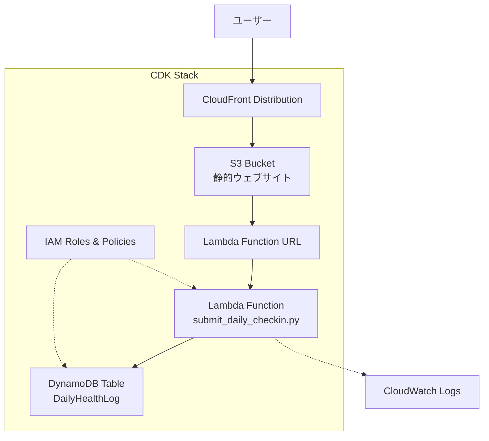

# 設計書

## 概要

この設計書は、既存のサーバーレスデイリーチェックインアプリケーションをAWS CDKでIaC化するための詳細な設計を定義します。現在手動でデプロイされているインフラストラクチャ（S3静的サイト、Lambda関数、DynamoDB）をCDKコードで管理可能にし、個人学習プロジェクトとして最適化された実装を実現します。

本設計は学習効果を最大化するため、AWS公式のベストプラクティスを採用しつつ、理解しやすさと実装可能性のバランスを重視しています。

## アーキテクチャ

### システム構成図


```mermaid
graph TB
    User[ユーザー] --> CF[CloudFront Distribution]
    CF --> S3[S3 Bucket<br/>静的ウェブサイト]
    S3 --> FU[Lambda Function URL]
    FU --> LF[Lambda Function<br/>submit_daily_checkin.py]
    LF --> DB[DynamoDB Table<br/>DailyHealthLog]
    
    subgraph "CDK Stack"
        S3
        CF
        LF
        FU
        DB
        IAM[IAM Roles & Policies]
    end
    
    LF -.-> CW[CloudWatch Logs]
    IAM -.-> LF
    IAM -.-> DB
```

### アーキテクチャの特徴

1. **サーバーレス構成**: 管理するサーバーなし、自動スケーリング
2. **CDN配信**: CloudFrontによる高速グローバル配信
3. **直接統合**: Lambda Function URLによるシンプルなAPI
4. **NoSQL永続化**: DynamoDBによる高可用性データストレージ
5. **IaC管理**: CDKによるインフラストラクチャのコード化

## コンポーネントと インターフェース

### 1. CDKスタック構成

```python
class DailyCheckinStack(Stack):
    """
    デイリーチェックインアプリケーション用のCDKスタック
    既存の手動デプロイされたインフラをIaC化
    """
    
    def __init__(self, scope: Construct, construct_id: str, **kwargs):
        # S3バケット（静的ウェブサイト）
        # CloudFrontディストリビューション
        # Lambda関数（既存コード使用）
        # Lambda Function URL
        # DynamoDBテーブル
        # IAMロールとポリシー
```

### 2. S3静的ウェブサイトコンポーネント（セキュリティ強化）

**目的**: 既存のS3/index.htmlをCDKで管理し、セキュリティベストプラクティスを適用

**設計仕様**:
- バケット名: CDK生成名（Generated Names使用）
- パブリックアクセスブロック: 全て有効
- CloudFrontからのアクセスのみ許可（OAC使用）
- バージョニング有効（ロールバック対応）
- 保存時暗号化有効（AES-256）

```python
# S3バケット設定（学習重点：セキュリティ設定）
bucket = s3.Bucket(
    self, "StaticWebsiteBucket",
    # 物理名指定なし（Generated Names）
    versioned=True,
    encryption=s3.BucketEncryption.S3_MANAGED,
    block_public_access=s3.BlockPublicAccess.BLOCK_ALL,
    enforce_ssl=True
)
```

### 3. CloudFrontディストリビューションコンポーネント（OAC対応）

**目的**: 既存のCloudFront設定をCDKで再現し、最新のセキュリティ機能を適用

**設計仕様**:
- オリジン: S3バケット
- Origin Access Control（OAC）使用（OAIの後継）
- HTTPS強制リダイレクト
- セキュリティヘッダー設定
- キャッシュ設定: 静的アセット用最適化

```python
# Origin Access Control（学習重点：最新セキュリティ機能）
oac = cloudfront.OriginAccessControl(
    self, "OAC",
    origin_access_control_origin_type=cloudfront.OriginAccessControlOriginType.S3,
    signing=cloudfront.Signing.SIGV4_ALWAYS
)

# CloudFrontディストリビューション
distribution = cloudfront.Distribution(
    self, "WebsiteDistribution",
    default_behavior=cloudfront.BehaviorOptions(
        origin=origins.S3Origin(bucket, origin_access_control=oac),
        viewer_protocol_policy=cloudfront.ViewerProtocolPolicy.REDIRECT_TO_HTTPS,
        cache_policy=cloudfront.CachePolicy.CACHING_OPTIMIZED,
        response_headers_policy=cloudfront.ResponseHeadersPolicy.SECURITY_HEADERS
    ),
    default_root_object="index.html"
)
```

### 4. Lambda関数コンポーネント（パフォーマンス最適化）

**目的**: 既存のlamda/submit_daily_checkin.pyをCDKでデプロイし、学習重点の設定を適用

**設計仕様**:
- ランタイム: Python 3.12（最新安定版）
- ソースコード: 既存ファイル使用
- メモリ: 256MB（200ms以内レスポンス目標）
- タイムアウト: 30秒
- 環境変数: DynamoDBテーブル名（Generated Name）
- デッドレターキュー: 基本設定

```python
# デッドレターキュー（学習重点：エラーハンドリング）
dlq = sqs.Queue(
    self, "SubmitCheckinDLQ",
    retention_period=Duration.days(14)
)

# Lambda関数
lambda_function = _lambda.Function(
    self, "SubmitCheckinFunction",
    runtime=_lambda.Runtime.PYTHON_3_12,
    code=_lambda.Code.from_asset("lamda"),
    handler="submit_daily_checkin.lambda_handler",
    timeout=Duration.seconds(30),
    memory_size=256,  # パフォーマンス最適化
    dead_letter_queue=dlq,
    environment={
        "DYNAMODB_TABLE_NAME": dynamodb_table.table_name  # Generated Name使用
    }
)
```

### 5. Lambda Function URLコンポーネント

**目的**: API Gateway不要のシンプルなHTTPエンドポイント

**設計仕様**:
- 認証: NONE（パブリックアクセス）
- CORS: CloudFrontドメイン許可
- HTTPメソッド: POST
- レスポンス形式: HTML（既存コードと互換）

```python
# Function URL設定
function_url = lambda_function.add_function_url(
    auth_type=_lambda.FunctionUrlAuthType.NONE,
    cors=_lambda.FunctionUrlCorsOptions(
        allowed_origins=["*"],  # 本番では特定ドメインに制限
        allowed_methods=[_lambda.HttpMethod.POST],
        allowed_headers=["Content-Type"]
    )
)
```

### 6. DynamoDBテーブルコンポーネント（セキュリティ強化）

**目的**: 既存のDailyHealthLogテーブルをCDKで管理し、データ保護を強化

**設計仕様**:
- テーブル名: CDK生成名（Generated Names使用）
- パーティションキー: Date (String)
- ソートキー: Period (String)
- 課金モード: オンデマンド（学習環境でのコスト最適化）
- ポイントインタイムリカバリ: 有効
- 保存時暗号化: AWS管理キー

```python
# DynamoDBテーブル（学習重点：セキュリティとコスト最適化）
dynamodb_table = dynamodb.Table(
    self, "DailyHealthLogTable",
    # 物理名指定なし（Generated Names）
    partition_key=dynamodb.Attribute(
        name="Date",
        type=dynamodb.AttributeType.STRING
    ),
    sort_key=dynamodb.Attribute(
        name="Period", 
        type=dynamodb.AttributeType.STRING
    ),
    billing_mode=dynamodb.BillingMode.ON_DEMAND,
    point_in_time_recovery=True,
    encryption=dynamodb.TableEncryption.AWS_MANAGED
)
```

## データモデル

### DynamoDBテーブルスキーマ

**テーブル名**: DailyHealthLog

**キー構造**:
- **パーティションキー**: Date (String) - YYYY-MM-DD形式
- **ソートキー**: Period (String) - "morning" または "evening"

**属性**:
```python
{
    "Date": "2024-01-24",           # PK: 日付
    "Period": "morning",            # SK: 時間帯
    "Condition": "普通",            # 体調
    "IsRoutine": "できた",          # ルーティーン
    "WorkPlace": "通所",            # 学習場所
    "WorkDetail": "IT学習",         # 学習内容
    "Notes": "特になし",            # 備考
    "SleepingHours": "7.0",         # 睡眠時間
    "EnergyMorning": "6",           # 気力（朝）
    "EnergyEvening": "5",           # 気力（夕方）
    "StaminaMorning": "6",          # 体力（朝）
    "StaminaEvening": "5",          # 体力（夕方）
    "Timestamp": "2024-01-24T09:30:00+09:00"  # 登録日時
}
```

### フロントエンドデータフロー

1. **ユーザー入力** → HTMLフォーム（S3/index.html）
2. **フォーム送信** → HTMX POST → Lambda Function URL
3. **データ処理** → Lambda関数 → DynamoDB書き込み
4. **レスポンス** → HTML断片 → HTMX DOM更新

## 正確性プロパティ（学習重点）

*プロパティとは、システムのすべての有効な実行において真であるべき特性や動作のことです。個人学習プロジェクトでは、理解しやすく検証可能なプロパティに焦点を当てます。*

### CDKインフラストラクチャ学習重点プロパティ

#### プロパティ1: S3バケットセキュリティ設定の正確性
*すべての*CDKデプロイメントにおいて、作成されるS3バケットはパブリックアクセスブロックが有効で、暗号化が有効で、バージョニングが有効であるべきである
**検証対象: 要件 1.3, 1.4, 1.5, 1.6**

#### プロパティ2: CloudFrontセキュリティ設定の正確性
*すべての*CDKデプロイメントにおいて、作成されるCloudFrontディストリビューションはHTTPS強制、OAC使用、セキュリティヘッダー設定を持つべきである
**検証対象: 要件 2.2, 2.3, 2.5**

#### プロパティ3: Lambda関数設定の正確性
*すべての*CDKデプロイメントにおいて、作成されるLambda関数は最新Pythonランタイム、適切なメモリ設定、DLQ設定、環境変数を持つべきである
**検証対象: 要件 3.2, 3.5, 3.6, 3.4**

#### プロパティ4: DynamoDBセキュリティ設定の正確性
*すべての*CDKデプロイメントにおいて、作成されるDynamoDBテーブルは暗号化有効、PITR有効、適切なキー設定を持つべきである
**検証対象: 要件 5.5, 5.6, 5.2, 5.3**

#### プロパティ5: IAM最小権限の正確性
*すべての*CDKデプロイメントにおいて、Lambda関数は必要最小限のIAM権限のみを持ち、cdk-nag検証に合格するべきである
**検証対象: 要件 6.1, 6.2, 6.5, 6.6**

#### プロパティ6: Generated Names使用の正確性
*すべての*CDKデプロイメントにおいて、リソースはCDK生成名を使用し、適切なタグ付けを持つべきである
**検証対象: 要件 7.1, 7.3**

## エラーハンドリング

### 1. CDKデプロイメントエラー

**エラーカテゴリ**:
- リソース作成失敗
- 権限不足エラー
- 依存関係エラー
- 命名競合エラー

**対処戦略**:
```python
# エラーハンドリング例
try:
    # リソース作成
    bucket = s3.Bucket(self, "StaticWebsiteBucket", ...)
except Exception as e:
    # ログ出力とクリーンアップ
    print(f"S3バケット作成エラー: {e}")
    # CDKは自動的にロールバック
```

### 2. Lambda関数実行時エラー

**既存コードのエラーハンドリング維持**:
- 既存のsubmit_daily_checkin.pyのtry-catch構造を保持
- CloudWatchログへの詳細なエラー情報出力
- ユーザーフレンドリーなエラーメッセージ

### 3. DynamoDB書き込みエラー

**対処方法**:
- 既存コードのDynamoDB例外処理を維持
- リトライ機能（boto3デフォルト）
- エラー時のHTMLレスポンス

### 4. CloudFront配信エラー

**監視と対処**:
- CloudWatchメトリクス監視
- オリジンエラー率の追跡
- 自動フェイルオーバー（S3の高可用性）

## テスト戦略（学習重点）

### 学習重点のテストアプローチ

このCDKインフラストラクチャプロジェクトでは、個人学習に最適化された**実践的なテスト戦略**を採用します。

#### Fine-grained Assertionsテスト（主要学習項目）
- **目的**: CDKリソースの特定プロパティを詳細に検証
- **学習価値**: インフラストラクチャテストの基本概念習得
- **対象**: 
  - S3バケットのセキュリティ設定
  - Lambda関数の設定値
  - DynamoDBテーブルのスキーマ
  - IAM権限の最小権限確認

#### 基本的なセキュリティ検証
- **目的**: cdk-nagによる自動セキュリティチェック
- **学習価値**: AWSセキュリティベストプラクティスの理解
- **対象**: IAMポリシー、暗号化設定、パブリックアクセス制御

#### LocalStackテスト
- **目的**: コスト効率的な開発・テスト環境
- **学習価値**: ローカル開発環境の構築スキル
- **対象**: 基本的なリソース作成とデプロイテスト

### テスト実装例

**Fine-grained Assertionsテスト例**:
```python
def test_s3_bucket_security_configuration():
    """
    学習重点: S3バケットセキュリティ設定の検証
    """
    template = Template.from_stack(stack)
    
    # パブリックアクセスブロック設定の確認
    template.has_resource_properties("AWS::S3::Bucket", {
        "PublicAccessBlockConfiguration": {
            "BlockPublicAcls": True,
            "BlockPublicPolicy": True,
            "IgnorePublicAcls": True,
            "RestrictPublicBuckets": True
        }
    })
    
    # 暗号化設定の確認
    template.has_resource_properties("AWS::S3::Bucket", {
        "BucketEncryption": {
            "ServerSideEncryptionConfiguration": Match.any_value()
        }
    })
```

### テストデータ管理（簡素化）

**テストデータ戦略**:
- 固定テストケースによる基本機能確認
- 日本語文字列を含む実際のフォームデータ形式
- テスト後の自動リソースクリーンアップ

**データクリーンアップ**:
- LocalStack環境でのテスト実行（コスト無し）
- テスト完了後の自動リソース削除