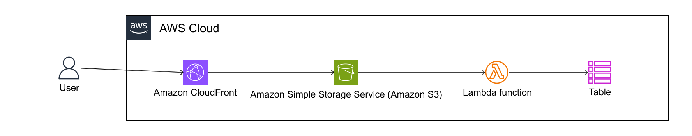

# チェックインツール
これは、AWSサーバーレスアーキテクチャを利用して、特定のサービスへ自動的にチェックイン処理を行うためのプロジェクトです。  
AWS SAA資格の学習、そして普段の体調管理をサポートする目的で作成しました。

## 概要
このツールは、CloudFrontにホストした静的・非同期なチェックインアプリの入力結果をLambda関数でDynamoDBに登録するものです。  

## アーキテクチャ

このプロジェクトは、以下のAWSサービスで構成されています。

- 　**Amazon CloudFront:** CDNとしてS3の静的ファイルを配信します。
-   **Amazon S3:** フロントエンドの静的ファイルを保管します。
-   **AWS Lambda:** Pythonで記述されたチェックインのデータ登録処理を実行します。
-   **AWS DynamoDB:** Pythonから送信されたデータを登録します。

## 主な機能
-   **フロントエンド表示:** S3に配置されCloudFrontでホスティングされたWebページ入力とその結果を確認できます。（`S3/index.html`）
-   **バックエンド:** Lambdaの関数がフロントエンドからPOST送信されたデータを、DynamoDBに登録します。

## 使用技術

-   **バックエンド:** Python 3.x
-   **フロントエンド:** HTMX
-   **インフラストラクチャ:** AWS S3, Lambda, CloudFront, DynamoDB