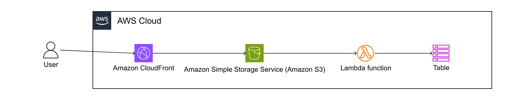

# デイリーチェックインツール
これは、AWSサーバーレスアーキテクチャを利用して、デイリーヘルスチェックインを行うためのプロジェクトです。  
AWS SAA資格の学習、そして普段の体調管理をサポートする目的で作成しました。

## 概要
このツールは、CloudFrontにホストした静的・非同期なチェックインアプリの入力結果をLambda関数でDynamoDBに登録するものです。  
**AWS CDK**を使用してインフラストラクチャをコードとして管理し、再現可能なデプロイメントを実現しています。

## アーキテクチャ

このプロジェクトは、以下のAWSサービスで構成されています。

- **Amazon CloudFront:** CDNとしてS3の静的ファイルを配信します。
- **Amazon S3:** フロントエンドの静的ファイルを保管します。
- **AWS Lambda:** Pythonで記述されたチェックインのデータ登録処理を実行します。
- **AWS DynamoDB:** Pythonから送信されたデータを登録します。
- **AWS CDK:** インフラストラクチャをコードとして管理します。



## 主な機能
- **フロントエンド表示:** S3に配置されCloudFrontでホスティングされたWebページ入力とその結果を確認できます。（`S3/index.html`）
- **バックエンド:** Lambdaの関数がフロントエンドからPOST送信されたデータを、DynamoDBに登録します。
- **IaC管理:** AWS CDKによるインフラストラクチャのコード化と自動デプロイメント

## プロジェクト構成

```
├── S3/                     # 静的ウェブサイトファイル
│   └── index.html         # フロントエンドアプリケーション
├── lamda/                 # Lambda関数コード
│   └── submit_daily_checkin.py
├── infra/                 # CDKインフラストラクチャコード
│   ├── infra/
│   │   └── infra_stack.py # メインCDKスタック
│   ├── tests/             # ユニットテスト
│   └── app.py            # CDKアプリケーション
└── .kiro/specs/cdk-infrastructure/  # 設計仕様書
    ├── requirements.md    # 要件定義
    ├── design.md         # 設計書
    └── tasks.md          # 実装計画
```

## デプロイメント

### 前提条件
- AWS CLI設定済み
- Node.js 18.x以降
- Python 3.12
- AWS CDK CLI (`npm install -g aws-cdk`)

### デプロイ手順
```bash
# CDKディレクトリに移動
cd infra

# 依存関係のインストール
pip install -r requirements.txt

# CDKブートストラップ（初回のみ）
cdk bootstrap

# デプロイ
cdk deploy
```

### 環境別デプロイ
```bash
# 開発環境
cdk deploy --context environment=dev

# ステージング環境  
cdk deploy --context environment=staging

# 本番環境
cdk deploy --context environment=prod
```

## 使用技術

- **バックエンド:** Python 3.12
- **フロントエンド:** HTMX
- **インフラストラクチャ:** AWS S3, Lambda, CloudFront, DynamoDB
- **IaC:** AWS CDK (Python)
- **テスト:** pytest, AWS CDK assertions

## 実装状況

### ✅ 完了済み機能
- CDKインフラストラクチャスタック実装
- S3静的ウェブサイトホスティング
- CloudFrontディストリビューション
- Lambda関数とFunction URL
- DynamoDBテーブル設定
- IAMセキュリティ設定
- Lambda関数バージョニング
- 環境別設定（dev/staging/prod/local）
- 包括的ユニットテスト（23テスト、100%成功）

### 📋 オプション機能
- プロパティベーステスト（8タスク）
- LocalStack開発環境設定
- CI/CDパイプライン

## 設計仕様

詳細な設計仕様は以下のドキュメントを参照してください：
- [要件定義書](.kiro/specs/cdk-infrastructure/requirements.md)
- [設計書](.kiro/specs/cdk-infrastructure/design.md)  
- [実装計画](.kiro/specs/cdk-infrastructure/tasks.md)